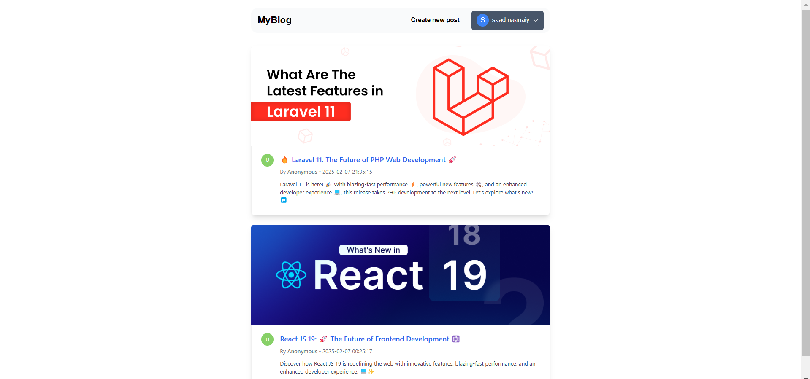

# 🚀 MERN Blog Project  

A full-stack **blog application** built with the **MERN Stack**, featuring modern UI/UX, authentication, and seamless navigation. 📝  

## 🌟 Features  

✅ **Full-Stack Development:** MongoDB, Express.js, React, Node.js (MERN)  
✅ **Ant Design + Tailwind CSS:** Modern & responsive UI 🎨  
✅ **JWT Authentication:** Secure user authentication 🔐  
✅ **React Router & Private Routes:** Protected pages & smooth navigation 🔄  
✅ **CRUD Blog System:** Create, edit, delete, and view blog posts 📝  
✅ **Dark Mode Support:** Light/Dark theme switching 🌙☀️  
✅ **Responsive Design:** Mobile-friendly & desktop optimized 📱💻  

---

## 🖼️ Preview  



---

## 🛠️ Tech Stack  

- **Frontend:** React, React Router, Tailwind CSS, Ant Design  
- **Backend:** Node.js, Express.js, MongoDB  
- **Authentication:** JWT (JSON Web Tokens)  
- **Icons & UI Enhancements:** Ant Design Icons, FontAwesome  

---

## 🚀 Installation & Setup  

### **1️⃣ Clone the Repository**  

```sh
git clone https://github.com/Saadnaanaiy/mern_blog.git
cd mern_blog
